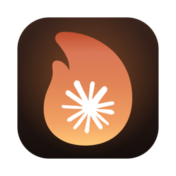
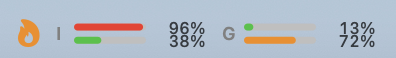
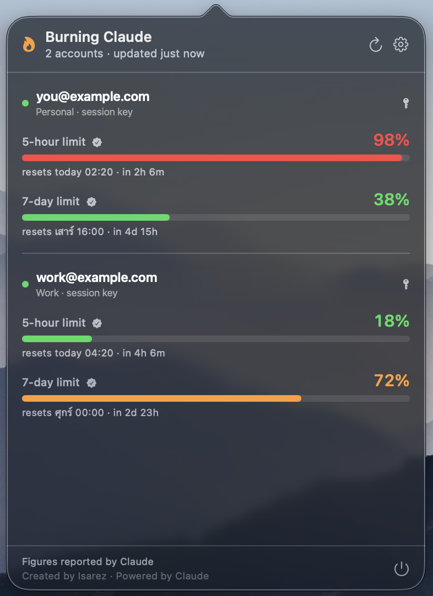
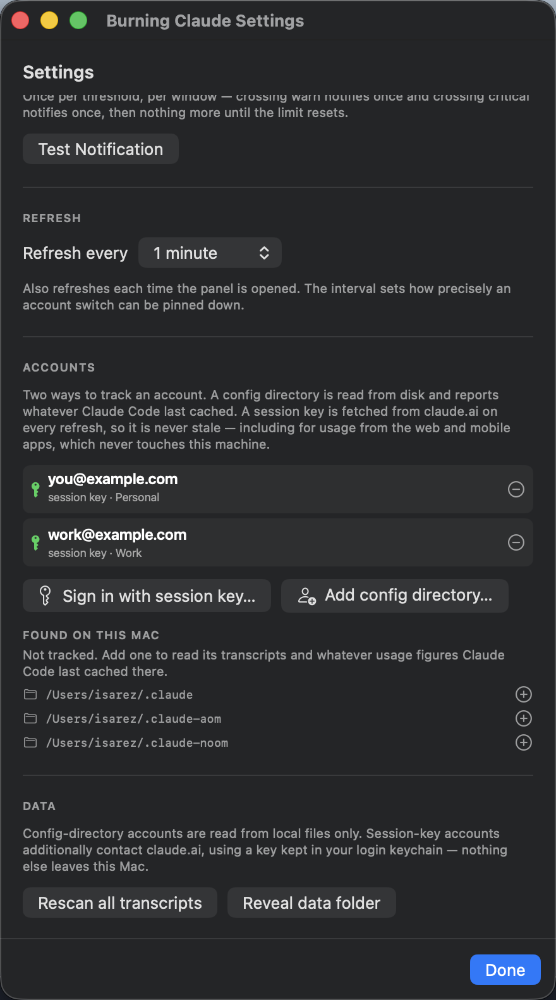
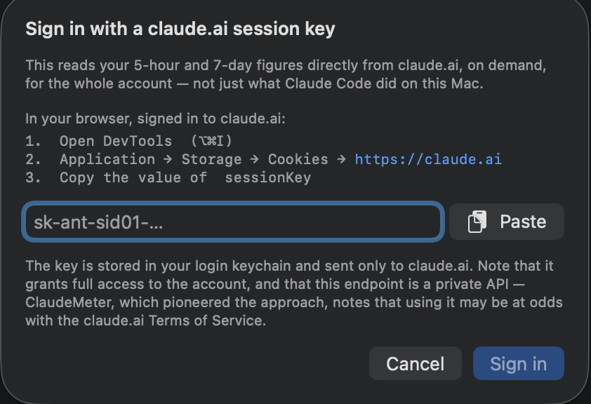

<p align="center">
  
</p>

<h1 align="center">Burning Claude</h1>

<p align="center">
  A macOS menu bar app that shows how close each of your Claude accounts is to
  its <b>5-hour</b> and <b>7-day</b> limits.
</p>

<p align="center">
  
</p>

---

## Features

- **One pair of bars per account** in the menu bar — 5-hour on top, 7-day
  below — labelled by initial, with a flame that takes the colour of whichever
  limit is hottest.
- **Real figures, never estimates.** Every percentage is Anthropic's own; the
  app does no local guessing.
- **Two sources, mixable per account**

  | Source | Freshness | Covers |
  |---|---|---|
  | **Session key** | every refresh, on demand | the whole account — claude.ai, mobile apps, every machine |
  | **Config directory** | whatever Claude Code last cached | Claude Code on this Mac |

- **Multi-account.** Each account is listed separately, because limits are
  per-account.
- **Nothing is tracked until you add it** — not even `~/.claude`. Directories
  found on your Mac are *offered*, never adopted.
- **Alerts** when a limit crosses your warn (75%) or critical (90%) threshold.
- **Private by default.** No telemetry, no analytics. A session key lives in
  your login keychain and is sent only to claude.ai.

## Screenshots

### The panel

Click the menu bar item for the full breakdown: each account's two limits, the
percentage used, and when each window resets.

<p align="center">
  
</p>

### Settings

⌘, or the gear in the panel. Bar length, thresholds, refresh interval, and the
account list.

<p align="center">
  
</p>

| Setting | Effect |
|---|---|
| **Meter length** | Length of each menu bar track, 8–80pt |
| **Warn at** / **Critical at** | Where bars turn amber and red, and alerts fire |
| **Refresh every** | 1, 5 or 10 minutes; also refreshes when the panel opens |
| **Accounts** | Add a session key or config directory, or remove any account |

### Session-key setup

**Settings → Accounts → Sign in with session key…** opens this sheet. Paste the
`sessionKey` cookie from a browser signed in to claude.ai and press **Sign in**.

<p align="center">
  
</p>

The key is **checked against claude.ai before anything is saved**, so a typo or
an expired cookie fails here rather than becoming a broken row. It then goes
into your **login keychain**. See [Find your session
key](#find-your-session-key) for where to get the cookie.

> A session key grants full access to the account — treat it like a password.
> The usage endpoint it reads is a private API, and
> [ClaudeMeter](https://github.com/eddmann/ClaudeMeter) (whose approach this
> adopts) notes that using it may be at odds with Anthropic's Terms of Service.
> That is why it is opt-in per account and never the default.

## Requirements

| | |
|---|---|
| **macOS** | 14 Sonoma or later |
| **Chip** | **Apple silicon only.** The release is `arm64`, not universal. Intel Macs must build from source — Rosetta does not help, it translates the other direction. |
| **Disk** | ~3 MB. Nothing else to install; SwiftUI ships with macOS. |
| **Dock** | None — menu bar item only. |

**And a Claude account**, in one of two forms. Either alone is enough, and you
can use both:

| | Needs | Notes |
|---|---|---|
| **Session key** | A [claude.ai](https://claude.ai) account, signed in to a browser | Your plan must be metered on the 5-hour / 7-day windows (Pro and Max are). If neither is reported, sign-in is rejected rather than showing an empty row. |
| **Config directory** | [Claude Code](https://claude.com/claude-code), signed in | `claude` must be on the `PATH` your login shell sets up, since the app finds it with `command -v claude`. |

No Anthropic **API key** is used — this reads subscription limits, not the API.

**What it asks of macOS:** the **login keychain** (only to store a session key),
**notifications** (optional, for threshold alerts), and **network access to
`claude.ai`** (only for session-key accounts — config directories work
offline). It needs no Full Disk Access, Accessibility, or admin password.

## Install

### Option A — installer package (recommended)

1. Download `BurningClaude-<version>.pkg` from the
   [latest release](https://github.com/Isarez/burning-claude/releases/latest).
2. Install it. The package is unsigned, so double-clicking is refused —
   either **right-click the `.pkg` → Open → Open**, or run:

   ```bash
   sudo installer -pkg ~/Downloads/BurningClaude-1.0.1.pkg -target /
   ```

3. It installs to `/Applications` and launches itself. Any running copy is quit
   first; settings, accounts and usage history are left alone.

No quarantine flag to clear on this route — unlike a downloaded `.zip`, a
package's payload does not carry one.

### Option B — Homebrew

```bash
brew install Isarez/tap/burning-claude
xattr -dr com.apple.quarantine /Applications/BurningClaude.app
open /Applications/BurningClaude.app
```

Naming the tap in full installs from it directly — no separate `brew tap`, no
`--cask`. The second line is **not optional**: the build is ad-hoc signed but
not notarized, so Gatekeeper refuses to open it until the flag Homebrew sets is
cleared.

Uninstall with `brew uninstall burning-claude`, or `--zap` to take settings and
usage history too.

### Option C — build it yourself

```bash
git clone https://github.com/Isarez/burning-claude.git
cd burning-claude
./build-app.sh && cp -R build/BurningClaude.app /Applications/
```

Needs Swift 5.9+ — Command Line Tools is enough, no Xcode. `./make-pkg.sh`
builds an installer package into `dist/` instead.

### After installing

Quit from the power button in the panel footer. Nothing starts it at login; add
it under **System Settings › General › Login Items** if you want it back after
a restart.

## Find your session key

You need the `sessionKey` cookie for `https://claude.ai` — it starts with
`sk-ant-sid01-`. Sign in to [claude.ai](https://claude.ai) first, then open the
developer tools with <kbd>⌥</kbd><kbd>⌘</kbd><kbd>I</kbd>:

| Browser | Where |
|---|---|
| **Chrome, Edge, Brave, Arc, Opera** | **Application** → Storage → **Cookies** → `https://claude.ai` |
| **Safari** | **Storage** → **Cookies** → `claude.ai` — first enable *Safari → Settings → Advanced → Show features for web developers* |
| **Firefox** | **Storage** → **Cookies** → `https://claude.ai` |

Click `sessionKey`, copy its **Value**, and paste it into **Settings →
Accounts → Sign in with session key…**.

Keys stop working when you sign out of claude.ai in that browser. The panel
says so explicitly instead of reading 0% — remove the account and add it again.

## Tracking Claude Code instead (or as well)

**Settings → Accounts → Add config directory** creates a directory under
`~/.claude-accounts/` and runs Claude Code's own sign-in against it. Anything
already on your Mac — `~/.claude`, `$CLAUDE_CONFIG_DIR`, any `~/.claude-*` — is
listed under **Found on this Mac** with a `+` to start tracking it.

Config directories report whatever Claude Code last cached, which can go stale
between sessions. Adding one line to your status line command publishes the live
figures instead, and the panel then matches your terminal exactly:

```bash
printf '%s' "$input" | jq -c '{rate_limits, at: now}' \
  > "${CLAUDE_CONFIG_DIR:-$HOME/.claude}/.claudetokenmeter-ratelimits.json"
```

Settings → **Live figures** shows this with a copy button.

## Privacy

- **Config-directory accounts** read files already on disk. No network, no
  credentials.
- **Session-key accounts** send the key to `claude.ai` over HTTPS and nowhere
  else. It is stored only in your login keychain (service
  `com.local.claudetokenmeter.sessionkey`), never in `UserDefaults`, app state
  or a log line, and removing the account deletes it.
- The app **cannot read your browser's cookie store** — you paste the key in
  yourself.
- App state lives in `~/Library/Application Support/BurningClaude/`.

## License

[MIT](LICENSE) — free to use, copy, modify and distribute, with the copyright
notice kept and no warranty given.

The Claude name and the mark in `Resources/claude.svg` belong to Anthropic and
are not covered by that grant; they appear here to label an unofficial tool for
Claude, which is neither built nor endorsed by Anthropic.
